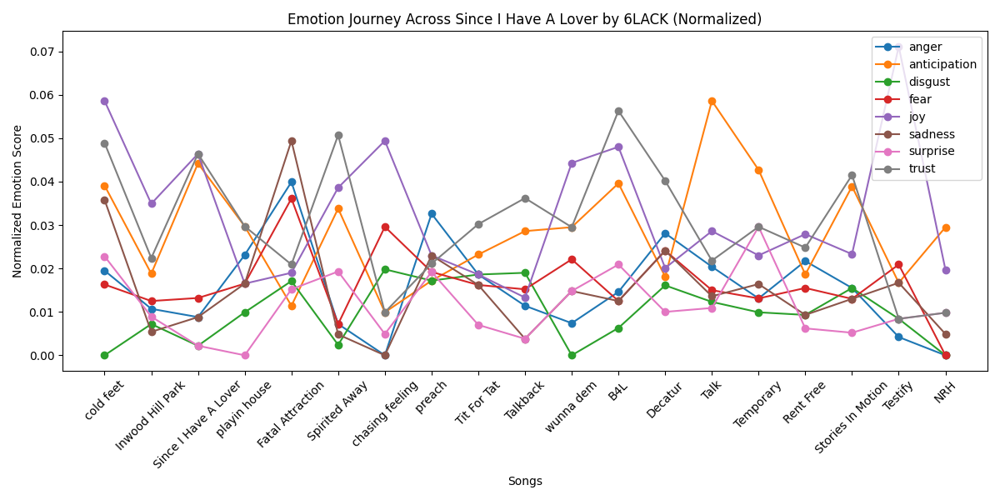
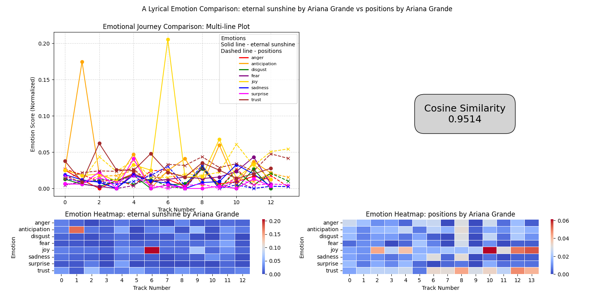

# Album Emotion Analyzer 🎵🧠

A Python tool that analyzes the emotional content of song lyrics across music albums. Visualizes the emotional journey of an album using the NRC Emotion Lexicon and allows for side-by-side comparisons of different albums.

## Key Features
- Scrape and process song lyrics from albums.
- Analyze emotions using the NRC Emotion Lexicon (e.g., joy, sadness, anger).
- Visualize the emotional progression of an album over time.
- Compare multiple albums side-by-side with multi-line plots, heatmaps, and similarity metrics.

## Visual Examples
### Emotional Journey of an Album


### Album Comparison – Heatmap & Emotion Plot


## Installation & Setup
1. Clone the repository:
   ```bash
   git clone https://github.com/yourusername/album-emotion-analyzer.git
2. Create a virutal environment
   ```bash
   python3 -m venv venv
   source venv/bin/activate
3. Install dependencies
   ```bash
   pip install -r requirements.txt

## How To Use
1. Update <code>.env</code> with a valid Genius API Access Token
2. Run the program:
   ```bash
   python main.py
3. Interact with the CLI
4. See your album data!

## Technologies Used
- Python
- Pandas
- Matplotlib
- NRC Emotion Lexicon
- Genius API (via library *lyricsgenius*)
- Other libraries:
    - Seaborn
    - Scikit-learn
    - Numpy
    - Wordcloud

## Future Improvements
- Training a ML model to analyze song lyric emotions more deeply
    - using DistilBERT with HuggingFace
- Integrate audio feature data (like tempo/genre/energy/valence etc.)
    - Spotify's API endpoint for audion features has been deprecated, will need to analyze song/album audio
    - See how lyric emotions correlate (or not) with certain audio features
    - Predict the lyrics of a song from its features, or vice versa
- Implement an interactive, concurrent GUI for easier user access

